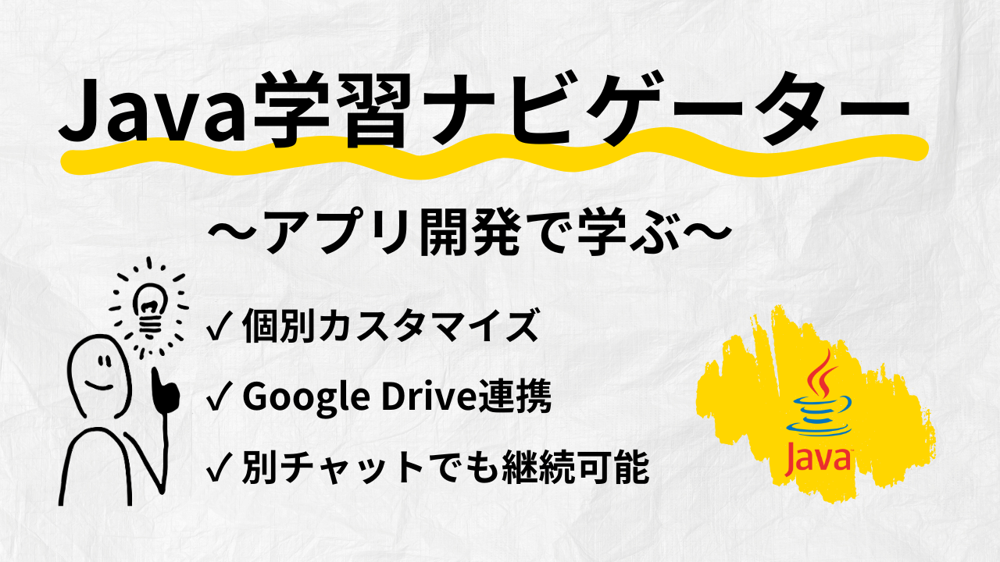
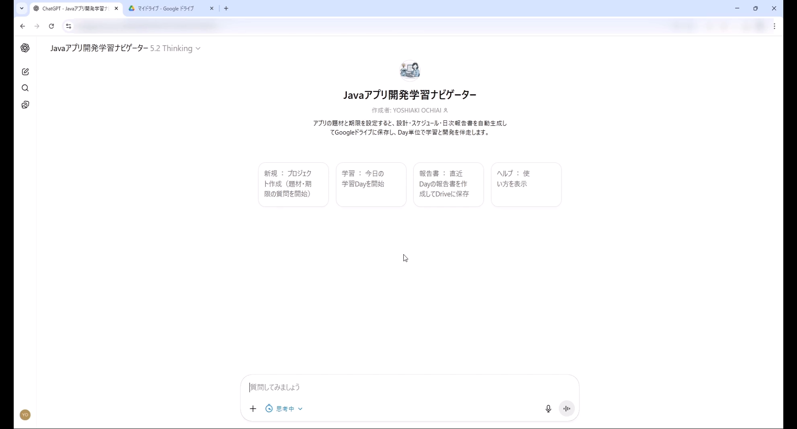
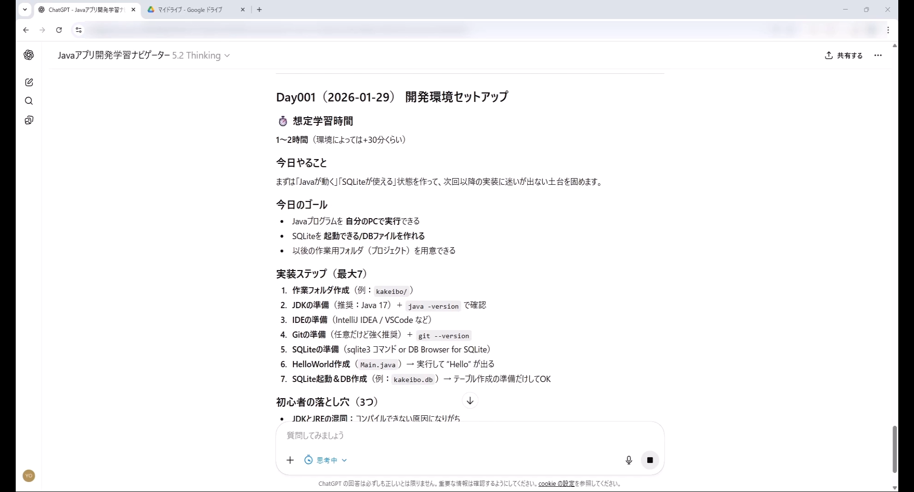
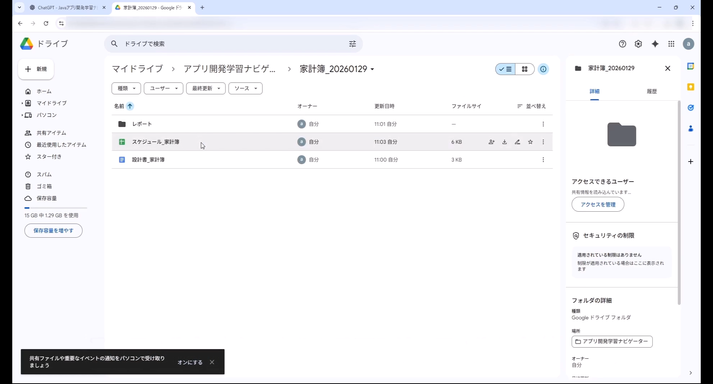

# Javaアプリ開発学習ナビゲーター

**Java初学者が「学習 → 設計 → 記録 → 継続」をDay単位で回せる学習支援GPT。**  
チャット操作だけで、**学習スケジュール・設計書・日次報告書を自動生成し、Google Driveに保存**。  
別チャット・別日でも学習を再開できる、**継続前提の学習設計**を実現しています。

📄 **1枚で分かる概要スライド（PDF）**  
👉 [PDFを開く](./docs/overview_slide.pdf)

🎬 **デモ動画（2分30秒 / Google Drive）**  
👉 [デモ動画を見る](https://drive.google.com/file/d/1DaqQ3ykRQGVxcSAFtQNmtKkNsLCi4Zib/view?usp=sharing)

---

## README 1行要約
**チャットで Day 学習を進めると、設計書・スケジュール・日次報告書が Drive に自動生成され、別チャットでも学習を再開できる Java 学習支援GPTs。**

---

## 📋 目次
- [概要](#-概要)
- [自動生成される成果物サンプル](#-自動生成される成果物サンプル)
- [主な機能](#-主な機能)
- [技術スタック](#-技術スタック)
- [使い方](#-使い方)
- [スクリーンショット](#-スクリーンショット)
- [ドキュメント](#-ドキュメント)
- [開発の背景](#-開発の背景)
- [今後の展望](#-今後の展望)
- [ライセンス](#-ライセンス)

---

## 📖 概要
**Javaアプリ開発学習ナビゲーター**は、Java初学者が「何を・どの順番で」学べばよいか迷わず進めるための GPTs です。  
学習の進捗や成果物は Google Drive に集約し、**学習の状態（正本）を Sheets に保持**することで、チャットが変わっても継続できます。

### 特徴
- ✅ **アプリ開発を通じて学ぶ**：座学ではなく、コンソールアプリを作りながら学習
- ✅ **個別カスタマイズ**：期限、休み日、学習ペースなどを対話で設定
- ✅ **学習記録の自動保存**：Drive に設計書/スケジュール/報告書を自動作成
- ✅ **別チャットでも継続**：Sheets を正本にして、いつでも再開可能

### 想定ユーザー
- Javaをこれから学び始める方
- 職業訓練/研修で「毎日何をすればいいか」を迷いがちな方
- ポートフォリオとして「学習の証拠（成果物）」を残したい方

---

## 📂 自動生成される成果物サンプル
- 📘 設計書サンプル（Google Docs）  
  [設計書を開く](https://docs.google.com/document/d/1D-YNkKV9r2FfQdFLlx2s7x1Ny-BV3uOca4KybCiUgYs/edit?usp=sharing)

- 📊 学習スケジュール（Google Sheets）  
  [スケジュールを開く](https://docs.google.com/spreadsheets/d/1eA7X8Whif9su6hnTD0LvG44vuoSl0g41e4iTfB0SyHo/edit?usp=sharing)
  
- 📝 日次報告書サンプル（Google Docs）  
  [報告書を開く](https://docs.google.com/document/d/12N2Slvv9Sh090CMri5hhbwzI9mTUJ5a5BpclQLx9Nw0/edit?usp=sharing)

---

## ✨ 主な機能

### 1. 初回ヒアリング（9項目）
ユーザーの学習スタイルに合わせて、題材・期限・休日・ペース・環境などを確認します。

### 2. プロジェクト自動作成（Google Drive連携）
ヒアリング後、Drive に次を自動作成します。
- プロジェクトフォルダ：`{題材}_{YYYYMMDD}`
- 設計書（Google Doc）：MVP/ユースケース/データモデル/DoD
- スケジュール（Google Sheet）：Plan/Meta（計画と進捗の正本）
- レポートフォルダ：日次報告書の保存先

### 3. Day別学習提示
`今日` で次の未完了 Day を提示します（ゴール/手順/落とし穴/Doneチェック）。

### 4. 進捗更新 & 日次報告書
`完了` でステータス更新し、必要に応じて日次報告書を作成します。

---

## 🧰 技術スタック
- ChatGPT（Custom GPTs）
- Google Apps Script（Webアプリ）
- Google Drive / Docs / Sheets

---

## 🚀 使い方（コマンド）
基本はこの5つで運用できます。

- `開始`：初回ヒアリング開始
- `今日`：次の未完了 Day を開始
- `Day003`：特定 Day を指定して開始
- `完了`：Day を完了（進捗更新）
- `中断`：途中で中断（次回 `今日` で再開）

---

## 📸 スクリーンショット

### 1) トップ（メニュー）

### 2) Day提示（学習コンテンツ）

### 3) Drive上に成果物が生成される

---

## 📚 ドキュメント
- [📄 機能仕様書（SPECIFICATION.md）](./docs/SPECIFICATION.md)
- [🏗 設計書（ARCHITECTURE.md）](./docs/ARCHITECTURE.md)
- [📄 1枚資料（PDF）](./docs/overview_slide.pdf)

---

## 💡 開発の背景
- 初学者は「学習順序」や「今日のゴール」が曖昧だと止まりやすい
- 進捗や成果物が散らばると、継続が難しい
- そこで「対話で進める」＋「成果物を自動で残す」を一体化しました

---

## 🔮 今後の展望
- Phase 2：学習内容の提示時点での説明詳細化
- Phase 3：学習ログ分析（つまずき傾向の可視化）
- Phase 4：他言語対応（Python 等）

---

## 📄 ライセンス
ポートフォリオ用の個人プロジェクトです。  
